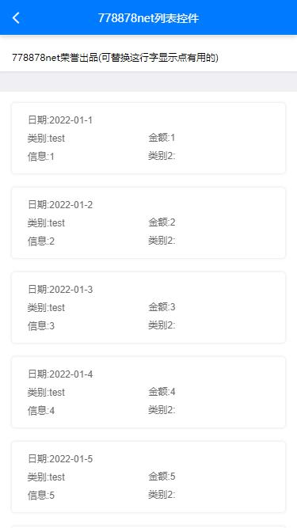

<h1 align="center">www778878net-list</h1>
<div align="center">


「www778878net-list」www778878net-list 低代码列表 ，帮助使用者快速构建列表。


[](https://www.apache.org/licenses/LICENSE-2.0)
[](https://qm.qq.com/cgi-bin/qm/qr?k=it9gUUVdBEDWiTOH21NsoRHAbE9IAzAO&jump_from=webapi&authKey=KQwSXEPwpAlzAFvanFURm0Foec9G9Dak0DmThWCexhqUFbWzlGjAFC7t0jrjdKdL)
[](https://qm.qq.com/cgi-bin/qm/qr?k=IGEbSpBveycfGNzhBnAdyS3eU-rqXf3d&jump_from=webapi&authKey=tfpHY+ASwWfJCvBuiW6c+Ifrsai8zJBPfLGr83M6r67OJxODwaKQx1O0oHC4KCS9)

</div>

## API文档地址：[http://www.778878.net/docs/#/www778878net-list/](http://www.778878.net/docs/#/www778878net-list/)
## github:[https://github.com/www778878net/www778878net-list](https://github.com/www778878net/www778878net-list)
## 协助开发qq群(点击加群)：[323397913](https://qm.qq.com/cgi-bin/qm/qr?k=it9gUUVdBEDWiTOH21NsoRHAbE9IAzAO&jump_from=webapi&authKey=KQwSXEPwpAlzAFvanFURm0Foec9G9Dak0DmThWCexhqUFbWzlGjAFC7t0jrjdKdL)
## 使用者qq群(点击加群)：[52098225](https://qm.qq.com/cgi-bin/qm/qr?k=IGEbSpBveycfGNzhBnAdyS3eU-rqXf3d&jump_from=webapi&authKey=tfpHY+ASwWfJCvBuiW6c+Ifrsai8zJBPfLGr83M6r67OJxODwaKQx1O0oHC4KCS9)


## 功能介绍
- 【稳定】:配置简单仅需两步（设置行格式、绑定分页结果数组）轻松完成完整列表展示 下拉刷新，上拉加载更多功能。
- 【开发快】:增删查改 分页 刷新仅需配置好API和回调 全部内部处理
- 【超灵活】:默认全部关闭 可一个个打开 同时支持自定义
- 【全兼容】:支持nvue，vue3，支持h5、app及各家小程序。

## 预览 
|                 最小使用                  |                      完整示例                       |
| :----------------------------------------------------------: | :----------------------------------------------------------: |
!||

## 最小示例代码
```html
<www778878net-list ref="list78" @getdata="getdata" :listSet="listSet"> 
</www778878net-list>
```

## 在线体验DEMO: [http://www.778878.net/docs/#/www778878net-list/](http://www.778878.net/docs/#/www778878net-list/)
## 扫码体验
